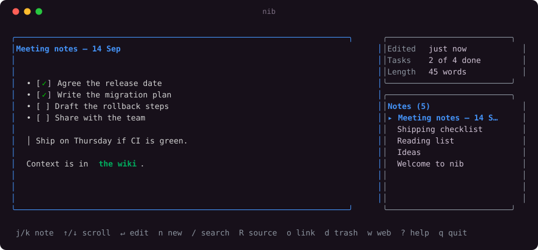

<div align="center">

# nib

**A Markdown note taker that lives in your terminal — and in your browser, from the same binary.**

Your notes are one SQLite file on your own disk. No account, no cloud, no sync service,
nothing running in the background.

[](https://github.com/Prathmeshgumal/nib/actions/workflows/ci.yml)
[](https://go.dev)
[](LICENSE)
[](#platforms)
[](https://github.com/Prathmeshgumal/nib/releases/latest)

</div>

<div align="center">
  
</div>

Press `w` and the same notes open in a browser with a formatting toolbar and live
preview. Both stay open at once, backed by the same file.

---

## The idea

Most note apps make you pick a side. Terminal tools are fast but ask you to give up a
readable, formatted view. Desktop apps are comfortable but ship a browser engine to draw
a text box, and want an account before you can write anything down.

`nib` is one 20 MB binary that gives you both views of the same SQLite file. It starts
in 46 ms with a thousand notes in it, holds about 27 MB of memory while you write, and
leaves nothing running when you quit.

---

## Install

Download it and run it. Nothing else to install — no Go, no Node, no runtime.

```bash
curl -L https://github.com/Prathmeshgumal/nib/releases/latest/download/nib-linux-amd64 -o nib
chmod +x nib
./nib
```

To keep it around, put it on your PATH:

```bash
mv nib ~/.local/bin/
```

On a 64-bit ARM machine — a Pi, an ARM server — use `nib-linux-arm64` instead.

<details>
<summary>Verifying the download</summary>

Every release ships a `checksums.txt`. Keep the original filename so the check can find
the file:

```bash
curl -LO https://github.com/Prathmeshgumal/nib/releases/latest/download/nib-linux-amd64
curl -LO https://github.com/Prathmeshgumal/nib/releases/latest/download/checksums.txt
sha256sum --ignore-missing -c checksums.txt
```

</details>

<details>
<summary>Building it yourself</summary>

You need [Go](https://go.dev/dl) and [Node](https://nodejs.org) to build, though neither is
needed to run the result.

```bash
git clone https://github.com/Prathmeshgumal/nib.git
cd Notes
./build.sh
cp nib ~/.local/bin/
```

</details>

<details>
<summary><code>nib: command not found</code></summary>

`~/.local/bin` isn't on your PATH:

```bash
echo 'export PATH="$HOME/.local/bin:$PATH"' >> ~/.bashrc && source ~/.bashrc
```

</details>

The first run leaves you a welcome note to poke at. Delete it whenever you like.

<h3 id="platforms">Platforms</h3>

Releases are built for **Linux**, `amd64` and `arm64`, and that is where the app has been
developed and used.

The code has no platform-specific dependencies and cross-compiles cleanly for macOS and
Windows, but I have not run it there, so those builds are not published yet. If you want
one, build it yourself with `GOOS=darwin ./build.sh` — and tell me how it goes.

---

## Why Go

The interesting constraint in a terminal app is **the gap between a keystroke and the
screen changing**. You notice 100 ms. You do not notice 1 ms. Everything else is
downstream of that.

Go compiles to a single static binary with no runtime to boot, and its garbage collector
is tuned for short pauses rather than peak throughput — which is exactly the trade a UI
wants. The practical effect is that startup is dominated by real work instead of by
loading an interpreter.

Measured on this machine, comparing like for like — the floor each runtime pays *before
your application code runs at all*:

| | Time |
| --- | --- |
| `/bin/true` — process creation floor | 0.7 ms |
| Python, empty script | 13.4 ms |
| Node, empty script | 20.4 ms |
| Node, after `require('react')` + `react-dom` | 38.7 ms |
| **`nib`, first painted frame with 1,000 notes** | **46 ms** |

That last row is not a floor. It is the whole application: opening the database, reading
every note, rendering Markdown to ANSI and painting a full two-pane UI. A Node-based
equivalent would begin from the 38.7 ms row and add its own work on top.

**The honest version of this comparison:** Go is not magic, and a carefully written Rust
or C TUI would beat it. What Go buys is that the fast path is the default one — no bundler,
no runtime to install, no cold-start penalty — while staying a language you can read on a
Sunday. And the pure-Go SQLite driver means the binary has no cgo, no system libraries, and
cross-compiles cleanly.

---

## What it costs your machine

Measured on an Intel i5-13450HX running Ubuntu, with a **1,000-note** database.

| | |
| --- | --- |
| Binary | **19.8 MB**, static, stripped |
| Cold start | **46 ms** median (34–50 ms) |
| Memory, terminal UI | **26–30 MB** resident |
| Memory, web server | **24.6 MB** idle, 28.5 MB under load |
| CPU while open and idle | **~1.4%** of one core |
| CPU after you quit | **none** — no daemon, no background process |
| Disk, 1,000 notes | **528 KB** (247 KB of that is the note text) |

And the operations you actually perform:

| | |
| --- | --- |
| Search across 1,000 notes | **7.2 ms** |
| List all 1,000 notes | **5.2 ms** |
| Write 1,000 notes over the API | **0.3 s** |
| Move the cursor (render a note) | **71 µs** |

Startup is flat: 49 ms with 41 notes, 46 ms with 1,000. The database is opened, not read
into memory, so the cost of having a lot of notes lands on search — and searching a
thousand notes still finishes inside a single frame at 60 Hz.

For scale on the memory number: the smallest Chrome renderer process running on this same
machine while I measured was 155 MB, and the largest was 405 MB.

The ~1.4% idle CPU is the terminal UI's render loop. It is not zero, and it is honest to
say so; quitting takes it to nothing at all, because there is nothing left running.

---

## Features

**Write in Markdown.** GitHub-flavoured, rendered live — bold, italics, strikethrough,
code, headings, quotes, tables, and task lists with real checkboxes. Leave the title blank
and the first line becomes it, the way Gists work.

**Lists carry on by themselves.** Press `↵` at the end of a list item and the next one is
waiting for you:

```
- [ ] buy milk     ↵ →  - [ ]        a new task, unticked
- buy milk         ↵ →  -
1. first           ↵ →  2.           and it keeps counting
> a thought        ↵ →  >
```

Indentation is kept, so a nested item stays nested. Press `↵` again on the empty item to
drop the marker and finish the list, or `alt+↵` for a line break that leaves the list
alone.

**Keyboard first, lazygit style.** `j`/`k` to move, `↵` to edit, `n` for a new note, `/` to
search, `?` for everything else. Formatting has keys too: bold, italic, strikethrough,
code, headings, three kinds of list, quotes and rules.

**Copy what you need.** `R` shows the note's Markdown full-screen with no borders, so a
mouse selection is the text and nothing else — no box-drawing characters, no padding.
Your terminal does the copying, so it works the same everywhere.

**Links behave like links.** The preview shows the link text, not the URL. Ctrl+click it,
or press `o`.

**Nothing is deleted in a hurry.** `d` moves a note to a trash; `u` walks back through
your deletes; `T` browses everything recoverable for 30 days. The database is snapshotted
every time the app starts, keeping the last 10.

**The same notes in a browser.** `w` opens a React UI with a formatting toolbar, live
preview and a light/dark theme — served from inside the binary, bound to `127.0.0.1`, so
nothing on your network can reach it.

**A small HTTP API**, so your notes are scriptable:

```bash
nib --web &
curl localhost:4321/api/notes
curl -X POST localhost:4321/api/notes \
  -H 'Content-Type: application/json' \
  -d '{"content": "# From the shell\n\n- [ ] it works"}'
```

Full reference: **[USAGE.md](./USAGE.md)**.

---

## Your data

```
~/.local/share/nib/nib.db        every note, one file
~/.local/share/nib/backups/        automatic snapshots, the last 10
```

Copy that file and you have copied everything. Point somewhere else with
`--db /path/to.db`, or experiment safely on a throwaway:

```bash
nib --db /tmp/scratch.db
```

Nothing leaves your machine. There is no account, no telemetry, and no network access
beyond the local page you start yourself.

---

## How it fits together

```
main.go              flags, and wiring the three together
internal/store/      SQLite — the single source of truth for both interfaces
internal/tui/        the terminal UI, built on Bubble Tea
internal/web/        HTTP API, and the React bundle compiled into the binary
client/              React 18, Vite, Tailwind, shadcn/ui
```

One store, two front ends. The web bundle is embedded with `go:embed`, which is why the
browser UI needs nothing installed to serve it. SQLite runs in WAL mode, so the terminal
and the browser can both be open and see each other's writes.

```bash
go test ./...     # store, terminal UI and HTTP behaviour
./build.sh        # rebuild the bundle and the binary
```

Tests cover the store, the terminal UI's behaviour through its update loop, and the HTTP
API end to end. CI runs `gofmt`, `go vet` and `go test -race`, then builds the binary with
the same script you would.

---

## Contributing

Issues and pull requests are welcome. If you are changing behaviour, a test that fails
before your change and passes after it is the most useful thing you can bring.

## License

MIT — see [LICENSE](./LICENSE).
